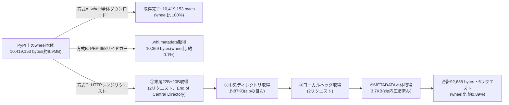
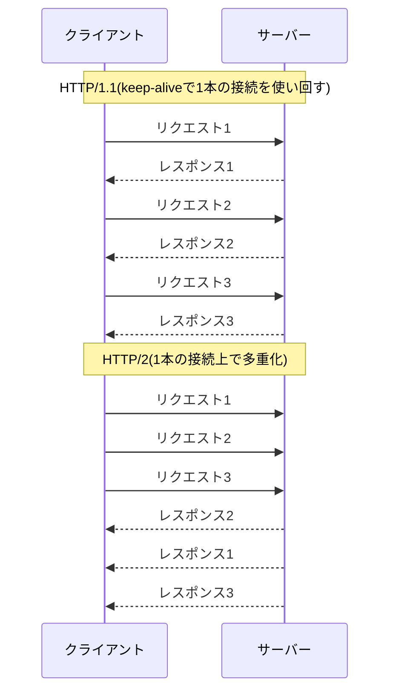
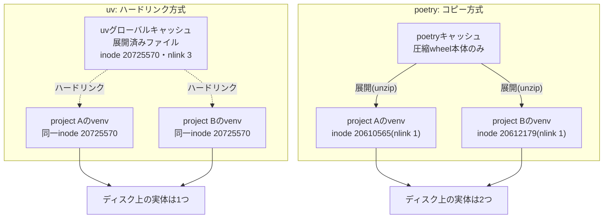

## はじめに

「uvはRust製だから速い」という説明を、どこかで見たことがある方は多いと思います。

筆者もその説明に一度は納得しました。ただ、よく考えると引っかかる点があります。

パッケージのインストールは、多くの時間がネットワーク通信の待ち時間に使われる処理です。通信I/O待ちの速さは、基本的にツールの実装言語には依存しないはずです。

だとすると、「Rust製だから速い」という説明だけでは、何かを説明し切れていない気がします。この違和感が、この記事の出発点です。

断っておくと、この記事はuvを批判するものではありません。uv自体は非常によくできたツールですし、実測でもその速さは裏付けられます。この記事で確かめたいのは、**その速さの理由**です。

想定読者は、pipやpoetryを使ったことがあり、uvについては「Rust製だから速いらしい」程度の理解の方です。TL;DRは次の3点です。

- uvが速い理由を「Rust製だから」の一言で片付けるのは不十分
- 本質は、通信I/Oの待ち時間を減らす・待たない工夫(メタデータのみ取得・並列化・HTTP/2・ハードリンクキャッシュ)にある
- 実測するとpipやpoetryも既にPEP 658に対応済みで、差は単一要因ではなく複合要因である

以降では、実際にDocker上でベンチマークを取り、uv・poetry・pipの挙動をログレベルまで追いかけて確認していきます。

## 1. uvとは

uvは、Pythonのランタイム(処理系そのもの)のバージョン管理と、パッケージの依存解決・インストールの両方を1つのツールでこなせるのが特徴です。

既存のツールは、どちらか片方の役割に特化しているものが多くありました。整理すると次のようになります。

| ツール | ランタイム管理 | 仮想環境の分離 | パッケージ管理 |
|---|---|---|---|
| pip | – | – | ✅ |
| virtualenv | – | ✅ | – |
| pyenv | ✅ | – | – |
| poetry | – | ✅ | ✅ |
| conda | ✅ | ✅ | ✅ |
| uv | ✅ | ✅ | ✅ |

condaも両方を担うツールですが、この記事ではpip/poetry/uvという「PyPIエコシステムの流れ」にあるツールを中心に扱います。

### ランタイム管理の違い: pyenv vs uv

pyenvは、指定したPythonバージョンのソースコードをダウンロードし、自分のマシン上でビルドします。ビルドには`gcc`や`make`などのビルドツールが必要で、時間もかかります。

uvは、[python-build-standalone](https://github.com/astral-sh/python-build-standalone)というプロジェクトが配布するバイナリを使います。ビルド済みのものを直接ダウンロードするだけです。ビルド不要なので速く、事前にビルドツールを揃える必要もありません。

一方で、python-build-standaloneが対応していない環境(一部の商用Linux OSなど)では、この方式が使えない場合がある点は留意が必要です。

この記事で以降扱うのは、ランタイム管理ではなく**パッケージ管理側**の速度差です。ここからが本題になります。

## 2. まず実測: pip vs poetry vs uv

理屈の前に、実際にどれくらい速度が違うのかを見ておきます。

### 実験環境

| 項目 | 値 |
|---|---|
| ベースイメージ | `python:3.12-slim` (Debian 13 "trixie") |
| Python | 3.12.13 |
| pip | 25.0.1 |
| Poetry | 2.4.1(公式インストーラのデフォルト最新安定版) |
| uv | 0.11.32 |
| ネットワーク | コンテナからPyPIへ直接アクセス(プロキシなし) |
| 計測日 | 2026-07-28(UTC)、すべてDockerコンテナ内で実行 |

対象パッケージは`streamlit`です。pipは`pip install`の単一コマンドで、poetry/uvは依存解決(lock)とインストール(install/sync)を分離して計測しました。各条件3回実行し、中央値を採用しています。

### 結果(秒、中央値)

| ツール | 条件 | lock/resolve | install/sync | 合計 |
|---|---|---|---|---|
| pip | cold | – | – | **25.48** |
| pip | warm | – | – | **21.31** |
| poetry 2.4.1 | cold | 5.73 | 7.56 | **13.29** |
| poetry 2.4.1 | warm | 4.18 | 5.72 | **9.97** |
| uv | cold | 0.64 | 2.15 | **2.82** |
| uv | warm | 0.07 | 0.14 | **0.20** |

同じ数値を横棒グラフに直すと、3ツールの差がより直感的につかめます。線形軸なので、uvの短さがそのまま伝わります。


*図1: streamlitインストールに要した時間(秒、中央値)。poetryとuvはlock(依存解決)とinstall/sync(取得・展開)の積み上げ、pipは単一バー*

cold(キャッシュなし)とwarm(キャッシュあり)の差分にも注目してください。倍率でまとめると次のようになります。

- uv coldは、pip coldの**約9.0倍速**、poetry coldの**約4.7倍速**
- uv warmは、pip warmの**約104倍速**、poetry warmの**約49倍速**
- poetryもpipよりかなり速く、cold同士で**約1.9倍速**

たしかにuvは速く、これ自体は間違いではありません。ただ、poetryとpipの間にも既に大きな差があります。ここが「Rust製だから」だけでは説明しきれない部分です。

### 余談: Poetry 2.4.1は1.8.3より遅かった

当初、この検証はPoetry 1.8.3で行っていましたが、最新の安定版で計測し直すべきと考え、2.4.1で再計測しました。結果は次の通りです(括弧内は参考値の1.8.3)。

- cold合計: 13.29秒(1.8.3は11.29秒、約+18%)
- warm合計: 9.97秒(1.8.3は7.94秒、約+26%)

つまり、同じPythonで書かれたツールでも、バージョンが上がって速くなったわけではありませんでした。これは「実装言語よりI/O設計の差が本質」という、この記事の主張を補強する材料になります。

以降では、この差がどこから生まれるのかを、インストール処理の内部まで分解して見ていきます。

## 3. インストールは3ステップでできている

パッケージのインストールは、大まかに次の3ステップに分解できます。

| ステップ | 内容 | ボトルネックの種類 |
|---|---|---|
| ① メタデータ取得 | 依存関係の情報をwebから取得 | 通信I/O(レイテンシ・往復回数) |
| ② 依存解決 | バージョンの整合性を計算 | 計算(CPU) |
| ③ 本体取得・展開 | wheel本体をwebから取得し展開 | 通信I/O + ディスクI/O |

①と③は通信I/Oが支配的で、②は計算が支配的です。ツールによって、この3ステップそれぞれの実装が異なります。

この3ステップの関係を図にすると、次のようになります。②の依存解決に失敗すると、追加のメタデータ取得のため①に戻る場合があります。


*図2: インストール処理の3ステップと、依存解決に失敗した際にメタデータ取得へ戻るループ*

### メタデータの中身

①で取得する「メタデータ」とは、そのパッケージが依存するライブラリと、そのバージョン制約の一覧です。

実際にstreamlitのメタデータを取得すると、直接依存だけで次のような制約が並んでいます(pip 25.0.1の`--dry-run -v`実行ログより抜粋)。

```
altair!=5.4.0,!=5.4.1,<7,>=4.0
blinker<2,>=1.5.0
click<9,>=7.0
gitpython!=3.1.19,<4,>=3.0.7
numpy<3,>=1.23
packaging>=20
pandas<4,>=1.4.0
pillow<13,>=7.1.0
pydeck<1,>=0.8.0b4
protobuf<8,>=3.20
pyarrow<25,>=7.0
requests<3,>=2.27
tenacity<10,>=8.1.0
toml<2,>=0.10.1
typing-extensions<5,>=4.10.0
starlette<2,>=0.40.0
uvicorn<1,>=0.30.0
httptools<1,>=0.6.3
anyio<5,>=4.0.0
python-multipart<1,>=0.0.10
websockets<17,>=12.0.0
itsdangerous<3,>=2.1.2
watchdog<7,>=2.1.5
```

これだけの制約を、依存パッケージそれぞれについて集めてから、初めて②の依存解決に進めます。ここからは、このメタデータをどう取得するかの話です。

## 4. ステップ①: メタデータ取得の高速化

### 昔のpipは、wheel全体をダウンロードしていた

メタデータは、wheel(実質zipファイル)の中の`dist-info/METADATA`というファイルに入っています。

かつてのpipは、依存関係を知るためだけに、wheel本体をまるごとダウンロードしていました。streamlitのwheelは約9.9MBあり、メタデータの取得だけにこのサイズが必要だった計算になります。

### PEP 658: メタデータだけを取り出す

[PEP 658](https://peps.python.org/pep-0658/)という仕組みが、2023年5月にPyPI上で有効化されました([PyPIの発表](https://discuss.python.org/t/pep-658-714-are-now-live-on-pypi/26693))。wheel本体とは別に、メタデータだけを含む`.whl.metadata`という小さなファイルが並置されるようになったのです。

実際にstreamlitのwheelで、両者のサイズを比較してみます(`curl -sI`のcontent-lengthより)。

| 対象 | サイズ |
|---|---|
| wheel本体 | 10,419,153 bytes(約9.9MB) |
| `.metadata`サイドカー | 10,369 bytes(約10.1KB) |
| 比率 | 約0.0995%(約1005分の1) |

wheel全体の1000分の1程度のダウンロードで、依存関係の情報だけを先に確認できます。これは大きな削減です。

### PEP 658非対応パッケージへの対応: HTTPレンジリクエスト

PEP 658の`.metadata`サイドカーがない古いパッケージでも、メタデータだけを取得する手段があります。

zip形式のファイルは、目次(central directory)がファイルの**末尾**に置かれています。そこでHTTPのRangeリクエストを使い、末尾→目次→METADATAエントリの位置、という順に必要な範囲だけを取得します。これでwheel全体をダウンロードせずに、メタデータだけを取り出せます。

実際にこの手順を自前のスクリプトで実装し、streamlitのwheelに対して試しました。

| 項目 | 値 |
|---|---|
| wheel全体サイズ | 10,419,153 bytes |
| Rangeリクエストの転送量合計(6回) | 92,655 bytes |
| 転送量/wheel全体比 | **約0.89%**(約112分の1) |

6回のリクエストで、末尾22バイト→末尾20バイト→中央ディレクトリ約87KB→ローカルヘッダ2回→METADATA本体3.7KB、という順に必要な部分だけを取得しています。

PEP 658のサイドカー(約1万バイト)は、この自前実装(約9万バイト、主にzip目次の読み込み分)よりもさらに約9倍小さく済みます。サイドカー方式は、zip構造を解析するコストとリクエストの往復回数自体を削減している、という点が違いです。

3つの方式が実際にやり取りするデータ量を図にすると、次のようになります。方式Cは末尾・目次・METADATA本体の順にたどります。


*図3: メタデータ取得3方式の転送量比較。方式Cはzipの目次が末尾にあることを利用し、末尾→目次→METADATAの順に辿る*

方式Cの3.7KBは、zip内で圧縮された状態のままの転送量です。

### ⚠️ ここで訂正が必要な点: pipのPEP 658対応は今はデフォルト

社内でこの話をする際、「pipは`.metadata`取得に特別なオプションが必要」という前提で話していました。しかし実測すると、これは現行のpipには当てはまりませんでした。

pip 25.0.1で、オプションなしの`pip install --dry-run -v streamlit`を実行してみました。streamlit本体を含む41パッケージすべてで、`.whl.metadata`へのHTTPリクエストによる依存情報取得が確認できました。ログ中には`Obtaining dependency information for ... from .../*.whl.metadata`という行が41件記録されています。

pipのPEP 658対応は、pip 22.3(2022年10月リリース)で追加されました。この時点から、追加オプションは不要です。つまり、今のpipは**オプションなしでメタデータだけを先に取得**します。

これはPEP 658より前からある`--use-feature=fast-deps`という別の実験的機能とは区別が必要です。fast-depsは、前節で自作したのと同じくHTTPレンジリクエストでwheelを遅延取得する仕組みで、pip 20.2(2020年7月)に導入されました。PEP 658とは別系統の機能で、pipのソースを確認したところ、現行版でも実験的フラグとして残っています(「本番環境では未推奨」という警告付きです)。PEP 658対応の旧名ではないので、この記事では両者を明確に分けて扱います。

さらに、poetryのログ(`poetry lock -vvv`)も確認しました。poetryも同様に`.whl.metadata`へのリクエストを行っていました(1.8.3・2.4.1いずれもmetadata関連の記録が42件)。

つまり「メタデータだけ先に取る」という設計は、pip・poetry・uvの3ツールいずれも(少なくとも現行バージョンでは)採用しています。**uvだけの専売特許ではありません。**

### では何が違うのか: 個別取得フェーズの並列化

パッケージのバージョン一覧そのものは、pip/poetry/uvいずれも[Simple API](https://peps.python.org/pep-0691/)(PEP 691のJSON形式)への1リクエストで取得します。差が出るのは、その後の**依存パッケージ1つずつのメタデータ個別取得**のフェーズです。

poetryはスレッドベースで複数のメタデータリクエストを並行処理します。uvは非同期I/Oを使い、より大量の並列リクエストをさばきます。

第2章の実測で見たlock(依存解決)フェーズの時間差は、この並列度の違いが効いている部分の1つです。次章では、依存解決そのものの計算方式の違いを見ていきます。

## 5. ステップ②: 依存解決

### バージョン整合はNP完全な問題

依存関係は、パッケージをノード、依存をエッジとしたグラフで表現できます。

すべての依存が矛盾なく満たせる組み合わせを見つける問題は、一般にNP完全であることが知られています。効率よく解ける汎用アルゴリズムは知られておらず、P≠NPを仮定するなら存在しないと考えられています。

だからこそ、実用上は「賢い探索の仕方」がツールごとの実装の勝負になります。

### pip: 深さ優先探索+バックトラッキング

pipの依存解決は、深さ優先探索とバックトラッキングをベースにしています。

古いバージョンでは、失敗したら**1つ前の選択**に戻るだけでした。pip 23.1(2023年4月)で「バックジャンピング」が導入され、衝突の原因まで一気に戻れるようになっています。

ただし、失敗パターンをまたいで記録・学習する仕組みは持っていません。PubGrubは、失敗を「非互換性(incompatibility)」として明示的に記録し、探索全体を体系的に枝刈りします。現行pipもバックジャンピングを取り入れていますが、この学習・枝刈りの体系性という点で、PubGrubとは程度の差があります。

### poetry / uv: PubGrub

poetryとuvは、どちらも[PubGrub](https://github.com/dart-lang/pub/blob/master/doc/solver.md)という制約充足問題向けのアルゴリズムを採用しています。もともとはDartのパッケージマネージャ`pub`のために考案されたアルゴリズムです。

PubGrubは、必然的に決まる依存を自動で推論し、失敗した場合は**原因を分析して根本原因まで一気に戻る**という特徴があります。失敗パターン自体を記録し、その学習情報を使って以降の探索を枝刈りします。

実装はツールごとに異なります。uvは[pubgrub-rs](https://github.com/pubgrub-rs/pubgrub)というRustのクレートを使い、poetryは`mixology`という独自のPython実装を持っています。

同じアルゴリズムを使っていても、実装の質でパフォーマンスは変わります。poetryとuvの間には、次の2点で差があります。

- **メモリアクセス**: poetryはPythonの`PyObject`経由でデータにアクセスするため、間接参照のオーバーヘッドがあります。uvはRustのプリミティブな型で直接データを扱えます。
- **キャッシュ活用**: lock時間で言えば、取得済みメタデータの再利用度合いが差になります。加えてインストール時には、poetryはwheel本体の再ダウンロードは避けるものの展開結果は共有しません。uvはグローバルキャッシュの展開済みファイルを、複数プロジェクトで再利用します(詳細は6章で実測します)。

### 実測での差

第2章の実測で見たlock(依存解決)フェーズの中央値を、あらためて並べます。

| ツール | 条件 | lock時間 |
|---|---|---|
| poetry 2.4.1 | cold | 5.73秒 |
| uv | cold | 0.64秒 |
| poetry 2.4.1 | warm | 4.18秒 |
| uv | warm | 0.07秒 |

同じPubGrubを使っていても、poetryとuvの間には数倍〜数十倍の差があります。アルゴリズムの選択だけでは説明できない、実装の質の差がここに表れています。

## 6. ステップ③: 本体取得とインストール

依存解決が終わったら、最後に本体(wheel)を取得して展開します。ここでも設計の差が実測に表れます。

### 並列ダウンロード

uvは非同期・ノンブロッキングI/Oを使い、デフォルトで**50並列**のダウンロードを行います。poetryはマルチスレッドの同期I/Oで、並列数は`os.cpu_count() + 4`です([poetryのソース](https://github.com/python-poetry/poetry/blob/main/src/poetry/config/config.py)の`installer_max_workers`実装で確認)。

実際に並列度を変えて計測しました。lockファイルは事前に作成しておき、`uv sync`(ダウンロード+展開)のみをコールドキャッシュで3回計測しています。

| 設定 | 中央値(秒) |
|---|---|
| `UV_CONCURRENT_DOWNLOADS=1`(直列) | **2.850** |
| デフォルト(50並列) | **2.213** |

並列化による寄与は、約1.29倍(約22%短縮)でした。

⚠️ ただし、この検証環境はPyPI CDNへの往復レイテンシが非常に小さいクラウド環境と見られます。レイテンシの大きい回線では、リクエストの往復回数がより効いてくるため、並列化の効果はさらに大きく出ると考えられます。この22%という数字は、並列化の効果を過小評価している可能性がある点は正直に書いておきます。

### HTTP/2: 多重化で1本の接続を使い回す

まず、PyPIのCDN側がHTTP/2に対応しているかを確認しました。`curl -v --http2`でfiles.pythonhosted.orgに接続すると、ALPNでサーバーが`h2`を受理しました。実際にHTTP/2で通信していることも確認できました。

問題は、クライアント側(uv・poetry)が実際にHTTP/2を使っているかです。ログを比較すると、明確な違いが出ました。

| ツール | 確認方法 | 結果 |
|---|---|---|
| uv | `RUST_LOG=trace uv lock` | `ALPN negotiated h2`のログを確認。**HTTP/2を実際に使用** |
| poetry 2.4.1 | `poetry lock -vvv` | `HTTP/1.1`が107件、`HTTP/2`は0件。**HTTP/1.1のみ** |

HTTP/1.1でもkeep-aliveを使えば、TCP接続やTLSハンドシェイクをリクエストごとに繰り返す必要はありません。ただし1本の接続では、複数のリクエストを直列に処理することになります。

HTTP/2の本質は、**1本の接続上で複数のリクエスト・レスポンスを多重化できる**ことです。往復を直列化せずに済み、同時に開く接続本数も減らせます。多数の依存パッケージのメタデータを取りに行くような場面では、この多重化がより効いてきます。

同じ1本の接続でも、リクエストを直列に流すか多重化するかで挙動が異なります。図で比較します。


*図4: HTTP/1.1のkeep-alive(1接続内は直列処理)とHTTP/2(1接続内での多重化)の比較。実際のHTTP/1.1クライアントは複数接続を並行して開くことで直列化の影響を緩和*

余談ですが、Poetry 2.4.1はPoetry本体用の専用venvに`httpx`と`httpcore`を新たに同梱しています(1.8.3にはありませんでした)。ただし実際のPyPI通信は、依然`requests`(`urllib3`)経由のHTTP/1.1のみで行われています。HTTP/2に必要な`h2`パッケージも同梱されていないため、httpxが使われるようになったとしても、今のままではHTTP/2は使えません。将来のバージョンでの対応余地として、記録に留めておきます。

### キャッシュ: ハードリンク vs コピー

最後はキャッシュの使い方です。`numpy`(コンパイル済みバイナリを含むwheel)を2つの独立したプロジェクトにインストールし、venv内とキャッシュ内のファイルを`stat`で比較しました。

前提として、ハードリンクとは同じファイル実体を指す別名(パス)のことです。`nlink`は、その実体を指している名前の数を表します。`nlink`が2以上なら、複数のパスが同じディスク上の実体を共有している、ということです。

なお、ハードリンクは同一ファイルシステム内でしか作成できません。キャッシュとvenvが別ファイルシステムをまたぐ場合、uvは自動でコピーにフォールバックします。

uvとpoetryのキャッシュ構造を図にすると、ディスク上のファイル実体が1つで済むか、2つに増えるかの違いが見えます。


*図5: uvはグローバルキャッシュの展開済みファイルを両プロジェクトへハードリンクし実体を1つに保つが、poetryは圧縮wheelのみキャッシュし展開のたびに実体が重複*

uvの結果です。

| 場所 | inode | nlink |
|---|---|---|
| project Aのvenv内`libscipy_openblas64_*.so` | 20725570 | 3 |
| project Bのvenv内 同ファイル | 20725570 | 3 |
| uvグローバルキャッシュ内 同ファイル | 20725570 | 3 |

3か所すべてでinodeが一致し、nlinkが3です。これは、uvがグローバルキャッシュの展開済みファイルを、両プロジェクトへ**ハードリンク**していることの直接的な証拠です。

poetry 2.4.1の結果です。

| 場所 | inode | nlink |
|---|---|---|
| project Aのvenv内 同ファイル | 20610565 | 1 |
| project Bのvenv内 同ファイル | 20612179 | 1 |

inodeが一致せず、nlinkは1です。poetryはキャッシュに圧縮済みのwheel本体だけを保存しています。展開(unzip)は毎回プロジェクトごとにやり直すため、ファイル実体がプロジェクトごとに重複します。

### ディスク使用量への影響

2プロジェクト分の実ディスク使用量を、`du -sb`を単一プロセスで実行して比較しました(inodeの重複を検出させた値です)。

| ツール | 2プロジェクト分の実使用量 | 2件目の増分 |
|---|---|---|
| uv | 57,197,631 bytes(約54.5MB) | 118,298 bytes(約115KB) |
| poetry 2.4.1 | 125,414,182 bytes(約119.6MB) | 差なし |

uvは、poetry(2.4.1)の**約45.6%**のディスク使用量で、同じ2プロジェクトを構築できます。特に、2件目以降のプロジェクトの追加コストがほぼゼロ(約115KB)という点は、複数プロジェクトを扱う開発者にとって実利がある差です。

第2章で見た「uv warmが0.20秒」という結果には、このハードリンクの効果が大きく効いています。ダウンロードも展開も、実質的に発生していないからです。なお、lockフェーズの0.07秒はメタデータキャッシュの効果で、ハードリンクとは別の要因です。

## 7. まとめ

「uvはRust製だから速い」は、間違いではありません。実際、Rustによる実装の効率の良さは、PubGrubの実装品質やファイルI/Oの速さに表れています。

ただ、それだけでは実測の差を説明し切れません。実測から見えてきた構図は、次の3層に整理できます。

- **通信を減らす**: PEP 658によるメタデータのみ取得、グローバルキャッシュによる再ダウンロードの回避
- **待たない**: メタデータ取得の非同期並列化、本体ダウンロードの50並列、HTTP/2による多重化
- **速く処理する**: Rustによる依存解決の実装効率、プリミティブなメモリアクセス

そして、この記事で最も強調したいのは、**PEP 658のようなメタデータ削減の基盤は、pip・poetryも既に採用している**という点です。今回の実測では、pip 25.0.1もpoetry 2.4.1も、`.whl.metadata`によるメタデータの先行取得を行っていました。

「メタデータだけ取る」はもうuvの専売特許ではなく、Pythonパッケージングのエコシステム全体で共有された改善です。uvとpip/poetryの実測差は、並列度・HTTP/2・キャッシュ方式・実装効率が積み重なった**複合的な結果**だと考えられます。

使い分けとしては、素早く・省ディスクで多数のプロジェクトを回したいならuvが有利です。既存のpoetryプロジェクトを無理に移行する必要はなく、poetry自身もPEP 658のような基盤の恩恵を受けて改善を続けています。ツールの選択は、速度だけでなく、チームの習熟度やエコシステムとの相性も含めて判断するのが妥当だと思います。

## 付録: 再現方法

この記事の実測はすべて、Dockerコンテナ内で再現できるようにスクリプト化しています。

```bash
cd dissecting-uv
docker build -t uv-bench .
docker run -d --name uvbench \
  -v "$(pwd)/results:/bench/results" \
  -v "$(pwd)/bench:/bench/bench" \
  uv-bench sleep infinity

# 実験1: インストール速度(cold)
docker exec uvbench python3 bench/exp1_pip.py --condition cold --runs 3
docker exec uvbench python3 bench/exp1_poetry.py --condition cold --runs 3
docker exec uvbench python3 bench/exp1_uv.py --condition cold --runs 3

# 実験1: インストール速度(warm)
docker exec uvbench python3 bench/exp1_pip.py --condition warm --runs 3
docker exec uvbench python3 bench/exp1_poetry.py --condition warm --runs 3
docker exec uvbench python3 bench/exp1_uv.py --condition warm --runs 3

docker exec uvbench python3 bench/exp1_aggregate.py

# 実験2: メタデータ取得(PEP658/レンジリクエスト)
docker exec uvbench python3 bench/exp2_range_metadata.py

# 実験3: 並列ダウンロードの効果
docker exec uvbench python3 bench/exp3_concurrency.py --concurrency 1 --runs 3
docker exec uvbench python3 bench/exp3_concurrency.py --runs 3

# 実験4: キャッシュ機構(ハードリンク vs コピー)
docker exec uvbench python3 bench/exp4_hardlink.py both

docker rm -f uvbench
```

詳細な生ログ・実測値は、リポジトリの`dissecting-uv/results/`以下に残しています。数値を疑うより、まず自分の手元で走らせてみるのが一番だと思います。
