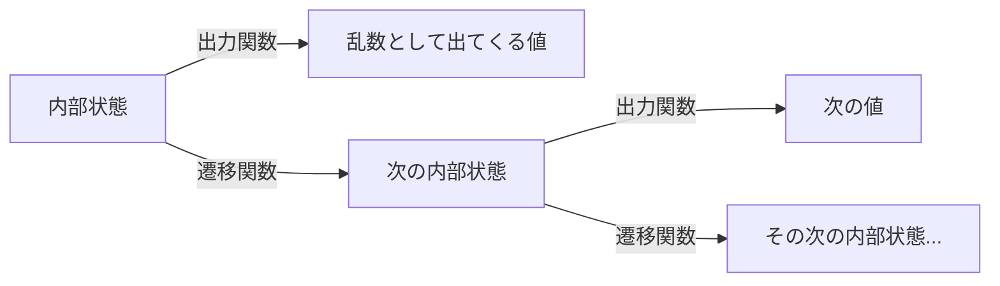

## はじめに

「シードを固定したのに、結果が微妙に変わった」

DS/MLをやっていると、一度はこの現象に出会います。
自分の手元では再現するのに、同僚のマシンでは精度の小数点以下がズレる。
コンテナを作り直したら、モデルの予測が1件だけ変わった。

このとき、どこまでが「そういうもの」で、どこからがバグなのか。

この記事では「シード固定はどのレイヤーまで通用するのか」を、理論と実測の両面から掘っていきます。
検証は次の階段を一段ずつ上る形で進めます。

1. 同じマシンでプロセスを再実行したら?
2. 同じマシンで、コンテナを作り直したら?
3. コンテナイメージ(ライブラリのバージョン)が変わったら?
4. ハードウェア(CPUアーキテクチャ)が変わったら?

先に結論の輪郭だけ言うと、「乱数そのもの」は驚くほど頑丈です。
壊れるのはいつも、乱数の外側です。

実験コードと生の実測データ(JSON)は、この記事のリポジトリの `experiments/random-reproducibility/` に一式置いてあります。
`run_all.sh` を叩けば手元で再現できます。

### 検証環境

- ホスト: Linux x86_64、Intel Xeon w7-3565X、Docker 29.2.1
- 基本イメージ: `python:3.12-slim`(Python 3.12.13)+ NumPy 2.1.3 / SciPy 1.14.1 / scikit-learn 1.5.2 / PyTorch 2.5.1(CPU版)
- BLAS実体: NumPyホイール同梱の scipy-openblas 0.3.27(pthreadsビルド。`threadpoolctl` で確認)
- 比較用の旧イメージ: `python:3.11-slim`(Python 3.11.15)+ NumPy 1.26.4 / scikit-learn 1.3.2
- 異アーキテクチャ検証: QEMUエミュレーションによる `linux/arm64`

## 1. 乱数は「計算」で作られている

最初に、そもそもの話をします。
コンピュータの乱数は、乱れていません。

`np.random.rand()` が返す値は、サイコロを振った結果ではなく、決まった計算式の答えです。
こうして作られる乱数を擬似乱数と呼び、作る装置をPRNG(擬似乱数生成器)と呼びます。

PRNGの中身は、3つの部品でできています。



- **内部状態**: いま装置がどんな状態か、を表す数値の塊
- **遷移関数**: 内部状態から「次の内部状態」を計算する式
- **出力関数**: 内部状態から「外に見せる乱数」を計算する式

トランプのシャッフルに例えると、こうなります。
「山札の並び」が内部状態、「決められた手順のシャッフル」が遷移関数、「一番上のカードをめくる」が出力関数です。

手順が完全に決まっているので、最初の山札の並びが同じなら、めくれるカードの順番は毎回同じです。
この「最初の山札の並び」を決めるのがシードです。

### 手で計算できる最小のPRNG

一番古典的なPRNGである線形合同法(LCG)は、漸化式1本です。

$$X_{n+1} = (a \times X_n + c) \bmod m$$

「前の値に決まった数を掛けて、決まった数を足して、決まった数で割った余りを取る」。
これだけです。

小さいパラメータで手計算してみます。
$a=5, c=1, m=16$、シード $X_0 = 1$ とすると:

```
X1 = (5×1 + 1) mod 16 = 6
X2 = (5×6 + 1) mod 16 = 15
X3 = (5×15 + 1) mod 16 = 12
X4 = (5×12 + 1) mod 16 = 13
```

`6, 15, 12, 13, ...` という列が出てきました。
一見バラバラですが、掛け算と割り算の余りだけで作られています。

誰がどの電卓で計算しても、この列は同じになります。
整数の四則演算に「機種による誤差」はないからです。

正確には、実務のPRNGは32bitや64bitの固定長整数で、桁あふれ(オーバーフロー)を起こしながら計算しています。
このラップアラウンドが機種によらず一致する根拠は、CPUではなく言語仕様にあります。CPythonもNumPyも、PRNGの内部計算には**符号なし整数**を使っており、符号なし整数のあふれは「$2^n$ で割った余りを取る」とC言語の仕様そのものが定義しているからです(ちなみに符号付き整数のオーバーフローはCでは未定義動作なので、実装がわざわざ符号なし型を選ぶのはこのためでもあります)。
なのでここでの「機種による誤差はない」は、無限精度の整数演算の話ではなく、固定長の符号なし整数演算という、言語仕様が挙動を完全に定義している足場の上に立っています。

この一点が、この記事全体を貫く柱になります。
**PRNGは整数演算だから、環境が変わっても同じ列を吐く。**

これは特定のライブラリが約束している話ではなく、整数演算の性質そのものから導かれる**数学的必然**です。
この記事では、この後もずっと「一致する」という結果に出会いますが、その一致には性質の違う3種類があります。

- **数学的必然**: 演算の定義そのものから、環境によらず結果が一意に決まるもの(整数演算、IEEE 754が規定する個々の加減乗除・平方根など)。ただし浮動小数点については、この必然が効くのは**演算1回ずつ**で、演算をどう組み合わせるか(順序や融合)には及びません。ここは5章で効いてきます
- **仕様・ポリシーとして保証**: 開発元が「今後もこの挙動を変えない」と明文で約束しているもの(Python `random` の互換シーダー保証、NumPy `RandomState` の凍結ポリシーなど)
- **たまたま(非保証)**: 誰も約束していないが、今のバージョン・今の実装がそうなっているだけのもの(超越関数やBLAS、機械学習モデルの学習結果の多くがここに入ります)

同じ「一致」でも、1番目と2番目は今後も安心して頼れますが、3番目はライブラリの些細なアップデート1つで裏切られます。
どの一致がどの分類に属するか、以降の章で逐一見ていきます。

### 実務で使われているPRNG

実務のPRNGは、LCGよりずっと凝った作りですが、骨格は同じです。

| 使う場所 | PRNG | 内部状態 |
|---|---|---|
| Python標準 `random` | MT19937 (メルセンヌ・ツイスタ) | 32bit × 624ワード |
| `np.random.seed()` / `RandomState` | MT19937 | 同上 |
| `np.random.default_rng()` / `Generator` | PCG64 | 128bit + 128bit |
| GPU・並列計算むけ | Philox など | カウンタ + 鍵 |

MT19937は624個の32bit整数を内部状態に持つ、いわば巨大なからくり装置です。
周期は $2^{19937}-1$。宇宙の原子数どころではない長さです[^mt]。

[^mt]: Matsumoto & Nishimura (1998), "Mersenne Twister: A 623-dimensionally equidistributed uniform pseudo-random number generator". https://math.sci.hiroshima-u.ac.jp/m-mat/MT/ARTICLES/mt.pdf

PCG64は「単純で速いLCGで下地を作り、出力時にシャッフル(permutation)をかけて統計的な癖を消す」という2段構えの設計です[^pcg]。
NumPyの新しいAPI `np.random.default_rng()` のデフォルトがこれです。

[^pcg]: O'Neill (2014), "PCG: A Family of Simple Fast Space-Efficient Statistically Good Algorithms for Random Number Generation". https://www.pcg-random.org/pdf/toms-oneill-pcg-family-v1.02.pdf

Philoxは変わり者で、前の状態から次の状態へ遷移していく方式を取りません。
「何番目の乱数が欲しいか」というカウンタを鍵付きの関数に通すだけなので、10000番目の乱数だけを単独で計算でき、何千スレッドが同時に乱数を欲しがるGPUに向いています[^philox]。

[^philox]: Salmon et al. (2011), "Parallel Random Numbers: As Easy as 1, 2, 3". SC11.

### 「浮動小数点の乱数」も実はビット演算

ここで1つ、よくある誤解を潰しておきます。
「乱数を0〜1の小数にする時点で、浮動小数点の誤差が乗るのでは?」という疑問です。

乗りません。
たとえばPython標準の `random.random()` は、MT19937が吐いた32bit整数2つから上位27bitと26bitを取り出し、つなげて53bitの整数を作り、$2^{53}$ で割ります[^cpython]。

[^cpython]: CPython `Modules/_randommodule.c`。`genrand_res53` は元のMT19937実装での関数名で、現行ソースでは `random_random` として実装されています(コメントに由来の記載があります)。 https://github.com/python/cpython/blob/main/Modules/_randommodule.c

$2^{53}$ での割り算は、浮動小数点の世界では指数部をずらすだけの操作です。
丸め誤差は出ません。

つまり一様乱数は、整数のビット操作だけで決定的に作られています。
「乱数の生成」そのものに、環境依存の入り込む隙間はないのです。

## 2. レイヤー0: 同じマシンで再実行する

理屈はわかったので、実測に入ります。
まずは一番易しい条件、同じマシン・同じ環境でスクリプトを再実行するケースです。

比較の方法にはこだわりました。
`print` した値の見た目ではなく、生成した値のビット表現(float64の生バイト列)をSHA256でハッシュ化して比べます。
「小数第7位まで同じだから同じ」ではなく、1ビットも違わないことを確認します。

この方法には1つ前提があります。
生バイト列を比較する以上、両環境のエンディアン(バイト順序)が一致していることが必要です。
今回比較するx86_64とARM64は、いずれもLinux上ではリトルエンディアンなので問題になりませんが、もし一方がビッグエンディアン環境なら、数値としては同じでも生バイト列は一致せず、この方法は偽陰性(実際は一致しているのに「不一致」と判定してしまう)を返します。

対象は次の4系統+scikit-learnです。

```python
random.seed(42)                  # Python標準
np.random.seed(42)               # NumPy レガシーAPI (MT19937)
np.random.default_rng(42)        # NumPy 新API (PCG64)
torch.manual_seed(42)            # PyTorch (CPU)
```

それぞれで乱数列を生成し、さらに `train_test_split(random_state=42)` と `RandomForestClassifier(random_state=42)` の学習まで行って、全部で15項目(乱数列やモデル出力のハッシュ12個+設定値)を記録。
実験の設計として、この「3回」は毎回新しいコンテナを起動して実行しています。単なるプロセス再実行より厳しい条件で一致すれば、緩い条件での一致も含意されるからです。
結果、**15項目すべてが完全に一致**しました(`results/e1_compare_*.json`、不一致0件)。

一例を挙げると、MT19937の一様乱数1000個のハッシュは3回とも `b3826bcc79486f1b...` です。
ちなみに `np.random.seed(42)` と `np.random.RandomState(42)` はハッシュまで同一でした。
グローバルシードの実体がRandomStateであることが、ここからも見て取れます。

ここは期待どおりです。
でもこのレイヤーにも、1つ有名な罠があります。

### 罠: PYTHONHASHSEED

シードを固定したのに実行のたびに結果が変わる。
その原因が乱数ではなく、`set` だったことはありませんか。

```python
features = ["age", "income", "region", "tenure_months", ...]
dedup = list(set(features))   # 重複除去のつもり
```

このコード、実行するたびに `dedup` の順番が変わります。
実測では、同じコードを3回実行してこうなりました。

```
元の順序:  age, income, region, tenure_months, ...
1回目:     avg_basket_size, num_purchases, age, is_churned, ...
2回目:     region, last_login_days, signup_channel, is_churned, ...
3回目:     また別の順序
```

`hash("hello")` の値も、3回の実行でそれぞれ `-3694237083992383962`、`4393989760295717189`、`449626946617816297` とバラバラでした。

犯人はハッシュランダム化です。
Pythonは `str` のハッシュ値を、セキュリティ上の理由からプロセスごとにランダムに変えています[^hashseed]。
悪意ある入力でdictの性能を最悪ケースに落とすDoS攻撃への対策で、乱数のシードとは完全に別系統です。

[^hashseed]: https://docs.python.org/3/using/cmdline.html#envvar-PYTHONHASHSEED

`set` の要素の並び順はハッシュ値に依存するので、プロセスが変わると順番も変わりえます。
特徴量のカラム順が実行ごとに入れ替わり、学習結果が変わる。
DSあるあるの筆頭です。

環境変数で `PYTHONHASHSEED=0` を設定して同じコードを3回実行すると、`hash("hello")` は3回とも `-2096571579003691106` で一致し、`set` 経由の順序も固定されました。
なお `0` は「シードを0にする」ではなく「ランダム化そのものを無効にする」特別な値です。前述のDoS対策を切ることになるので、外部入力を受ける本番プロセスでは使いどころに注意してください。
ただし本質的な対処は「順序が欲しいところで `set` に頼らない」、つまり `sorted()` を挟むことです。

なお `dict` はPython 3.7以降、挿入順の保持が言語仕様で保証されているので、この問題の影響は受けません[^dictorder]。
順序が暴れるのは `set` です。

[^dictorder]: "the insertion-order preservation nature of dict objects has been declared to be an official part of the Python language spec." https://docs.python.org/3/whatsnew/3.7.html#summary-release-highlights リファレンス側にも "Changed in version 3.7: Dictionary order is guaranteed to be insertion order. This behavior was an implementation detail of CPython from 3.6." とあります。 https://docs.python.org/3/library/stdtypes.html#dict

## 3. レイヤー1: コンテナを作り直す

次の階段、コンテナの作り直しです。
「イメージは同じでも、コンテナは毎回別物だから何か変わるのでは」と不安になる人がいます。

ここは30秒で終わります。
同一イメージから独立に起動した3つのコンテナで、**全項目一致、不一致0件**でした(`results/e3_compare_*.json`)。
前章で断ったとおり、あの「3回実行」も毎回新しいコンテナで測っているので、実はこのレイヤーの答えは前章に織り込み済みでした。

考えてみれば当然です。
コンテナイメージには、Pythonもnumpyもlibc(数学関数の実装)も、バイナリのバイト列ごと固まって入っています。
同じバイナリを同じCPUで動かせば、同じ結果が出ます。

PRNGは整数演算なので言わずもがな。
浮動小数点演算も、実行されるマシンコードとCPUが同じなら、同じ入力から同じビットが出ます。

つまり「コンテナを作り直したら結果が変わった」ときは、コンテナ化以外の何かが変わっています。
イメージのタグが実は動いていた(`latest` 問題)、環境変数が違う、スレッド数が違う。
疑うべきはそのあたりです。

## 4. レイヤー2: イメージ(バージョン)が変わる

ここから景色が変わり始めます。
Pythonやライブラリのバージョンが違う2つのイメージで、同じシードは同じ乱数列を吐くのでしょうか。

これは実測の前に、各ライブラリが何を約束しているかを確認する必要があります。
「たまたま一致する」と「一致が保証されている」は別物だからです。

### 各ライブラリの約束を読む

**Python標準 `random`** は、かなり強い約束をしています。
公式ドキュメントいわく、アルゴリズムやシード方式は将来変わりうるが、「互換シーダーに同じシードを与えたときの `random()` の出力列は変えない」ことを保証する、と明言しています[^pyguarantee]。

[^pyguarantee]: "The generator's random() method will continue to produce the same sequence when the compatible seeder is given the same seed." https://docs.python.org/3/library/random.html 6章で触れるマルチスレッド時の限定("as long as multiple threads are not running")も、同ページの記述です。

**NumPyは、APIによって約束が正反対**です。
ここがこの章の肝です。

古いAPIの `np.random.seed()` / `RandomState` は、ストリーム互換性(同じシード→同じ列)を凍結保証しています[^rs-compat]。
丸め誤差の範囲とバグ修正を除き、列が変わることはありません(なおNEP 19は、LAPACKの実装に依存する `multivariate_normal()` のような例外の存在にも触れています)。

[^rs-compat]: NumPy公式ドキュメント。"A fixed bit generator using a fixed seed and a fixed series of calls to 'RandomState' methods using the same parameters will always produce the same results up to roundoff error except when the values were incorrect. RandomState is effectively frozen and will only receive updates that are required by changes in the internals of Numpy." https://numpy.org/doc/stable/reference/random/legacy.html#numpy.random.RandomState 同趣旨の記述は https://numpy.org/doc/stable/reference/random/compatibility.html にもあります。

一方、新しいAPIの `np.random.default_rng()` / `Generator` は、バージョン間のストリーム互換を原則として保証しないと宣言しています。
NEP 19という公式の意思決定文書に、理由ごと書かれています[^nep19]。

[^nep19]: NEP 19 — Random number generator policy. https://numpy.org/neps/nep-0019-rng-policy.html なお同文書には例外条項もあり、`random()`・`integers()`・`bytes()` の3メソッドのストリーム互換だけは保証対象とされています。ただしこれは2018年のNEP本文の記述で、現行の `Generator` 公式ドキュメントはこの例外に触れず、全体として互換性を保証しない("No Compatibility Guarantee")とだけ書いており、両文書の間には齟齬があります。

乱暴に要約すると、こうです。
「未来永劫ストリームを固定するという古い約束は、実際には守りきれない過剰な約束だった。しかもアルゴリズム改善の足かせになっていた。ビット単位の再現性が必要なら、ソフトウェアスタック全体をバージョン固定するのが今の標準的な作法だ」。

`RandomState` は旧型のゼンマイ時計です。
何年経っても同じ動きをするよう、仕様で縛られています。
`Generator` は新型のスマートウォッチで、アップデートで中身が良くなる代わりに、更新後は同じ入力でも出力が変わることがあります。
それは故障ではなく仕様です。

**scikit-learn** も、バージョン間の一致を保証していません。
リリースノートの冒頭に毎回、定型文でこう書いてあります[^sklearn]。
「同じデータ・同じパラメータでも、モデリングロジックの変更(バグ修正や改良)や乱数サンプリング手順の変更により、前バージョンと異なるモデルが生成されることがある」。

[^sklearn]: 例: https://scikit-learn.org/stable/whats_new/v1.3.html 冒頭の "Estimators and functions, when fit with the same data and parameters, may produce different models from the previous version."

`random_state` が約束するのは、あくまで同一バージョン内での決定性です。

### 実測: バージョンをまたいでみる

では実際、どのくらい一致するのか。
Python 3.11 + NumPy 1.26.4 + sklearn 1.3.2 のイメージと、Python 3.12 + NumPy 2.1.3 + sklearn 1.5.2 のイメージで比較しました(`results/e4_compare.json`)。
なおこの比較ではPython・NumPy・scikit-learnが同時に変わっているため、不一致が出たときに「どのライブラリの変更が原因か」までは、この実験単体では切り分けられません。

結果は14項目中12項目が一致。
不一致2項目のうち1つはsklearnのバージョン文字列そのもの(当然違う)なので、計算結果の不一致は実質1項目です。

**一致したもの:**

- `RandomState`(MT19937)の生の整数列・一様乱数・正規乱数。凍結保証どおりです
- `Generator`(PCG64)の生の整数列・一様乱数・正規乱数。NumPyのメジャーバージョン(1.26→2.1)をまたいでビット単位一致
- `RandomForestClassifier(random_state=42)` の予測値と `feature_importances_`。sklearnのバージョンを2つ飛んでも完全一致

**一致しなかったもの:**

- `LogisticRegression(random_state=42)` の係数 `coef_`。予測クラスは一致したのに、係数の浮動小数点値だけがズレました

面白いのはGeneratorです。
一致した項目のうち、生の整数列と一様乱数はNEP 19の例外条項(`integers()` と `random()` は互換保証)の範囲内なので、NEP 19の文面上は約束どおりの一致です。
ただし注意が要ります。現行の `Generator` 公式ドキュメントはこの例外条項を引き継いでおらず、「互換性は保証しない」とだけ書いています[^nep19]。設計文書と現行ドキュメントの間に齟齬がある以上、堅く運用するならこの3メソッドの一致も保証扱いしないほうが安全です。
一方、正規乱数の一致には最初から何の保証もありません。
次のバージョンで変わっても文句は言えない、たまたまの安定です。
同じ「一致」という実測結果の中に、約束された一致とたまたまの一致が同居しているわけです。

もう1つ、モデルによって頑丈さが違いました。
RandomForestは決められた乱数で木を作る、いわば「乱数のレシピを機械的に実行する」モデルなので、乱数列さえ同じなら結果も同じになりやすい。
一方LogisticRegressionは反復的な最適化(ソルバー)で解に近づいていくので、バージョン間の実装変更で収束の道筋が微妙に変わると、着地点の下位ビットが動きます。
もっとも、前述のとおりこの実験では複数ライブラリが同時に変わっているので、この説明はモデルの構造から見た推測で、原因の特定まではしていません。

レイヤー2の答えはシンプルです。
**一致に頼ってよいかどうかは、運ではなく「各ライブラリの互換性ポリシー」で決まる。**
実際に一致するかどうかは、Generatorの正規乱数のようにポリシーの外側でたまたま揃うこともあります。頼ってよいのは、ポリシーが約束している範囲だけです。
そして多くのライブラリは、バージョン間の一致を約束していません。

ライブラリのバージョンを固定する(lockファイルを使う)ことが、このレイヤーでの唯一の防御です。

## 5. レイヤー3: ハードウェアが変わる

いよいよ本丸です。
CPUそのものが変わったら、結果は一致するのでしょうか。

手元にはx86_64のマシンが1台しかないので、QEMUエミュレーションを使いました。
Dockerの `--platform linux/arm64` 指定で、同じマシン上にARM64(スマホやAppleシリコンと同じ命令セット)の環境を作れます。
ネイティブなら数秒のスクリプトが約100秒かかりましたが、動きはします。

先に検証の限界を断っておきます。
QEMUはARMの命令をソフトウェアで再実装したものですし、数値ライブラリが実行時に選ぶSIMDの実装経路も、実機のARMチップとは違いえます。
なので「どの関数が一致したか」という個別の結果を、そのままApple SiliconやGravitonに外挿することはできません。
逆方向も同じで、ここで観測された個別の不一致が、実機のARMではなくQEMU自身の実装に由来する可能性も排除できていません。
ここで確かめられるのは「アーキテクチャをまたぐと差が出る演算が存在するか」という定性的な事実です。

同じイメージ定義をamd64とarm64でビルドし、23項目を比較しました(`results/e5_compare.json`)。
結果は16項目一致、7項目不一致。
不一致のうち1つはtorchのバージョン文字列の表記差(aarch64向けホイールには `+cpu` タグが付かない)なので、計算結果の不一致は6項目です。
その内訳が、この記事で一番語りたいところです。

### 乱数そのものは、アーキテクチャをまたいでも同じ

まず生のPRNG出力です。

- MT19937の整数列・一様乱数: **一致**
- PCG64の整数列・一様乱数: **一致**
- MT19937・PCG64の正規乱数(標準正規分布への変換後): **一致**(ただし、これはたまたまです。すぐ後で述べます)

1章の理屈どおり、整数列と一様乱数はアーキテクチャが変わってもビット単位で一致しました。
整数演算とビット操作だけで完結しているので、これは**数学的必然**です。

正規乱数への変換は話が別です。
Ziggurat法(`Generator` 側)やpolar法(`RandomState` 側)といった実装は、指数関数や対数といった超越関数を経由する分岐を持つため、原理的には後述する「非保証」の土俵にいます。
今回はたまたま両アーキで一致しましたが、これは4章で見たNumPyのバージョン間互換性の話(正規乱数の一致に保証はない、NEP 19の例外は `integers()`・`random()`・`bytes()` の3メソッドのみ)と同じ理由で、**たまたまの一致**だと考えるべきです。

### 壊れ始めるのは「乱数を使った、その先の計算」

問題はここからです。
同じシードから作ったデータに対して、いろいろな計算をした結果を比べます。

| 計算 | x86_64 vs ARM64 |
|---|---|
| `np.sin`(10万要素) | 一致 |
| `np.exp`(10万要素) | **不一致** |
| `np.sum`(2000万要素の総和) | 一致 |
| 行列積 512×512(BLAS) | **不一致** |
| RandomForestの予測クラス | 一致 |
| RandomForestの `feature_importances_` | **不一致** |
| LogisticRegressionの予測クラス | 一致 |
| LogisticRegressionの `coef_` | **不一致** |
| PyTorch MLPの最終loss値 | 一致 |
| PyTorch MLPのloss曲線(全50ステップ) | **不一致** |
| PyTorch MLPの最終パラメータ | **不一致** |

一致と不一致が入り混じった、見事にまだらな結果です。
このまだら模様には、ちゃんと理屈があります。

先に断っておきたいことがあります。
この表の「一致」は一枚岩ではありません。
`np.sin`・`np.sum`・RandomForestとLogisticRegressionの予測クラス・PyTorch MLPの最終loss値が「一致」なのは、規格や公式ポリシーが約束しているからではなく、今回試したバージョン・この規模のデータの実装がたまたまそうなっていたに過ぎません。
NumPyやPyTorchのマイナーバージョンが1つ上がるだけで、これらの一致は崩れうる**たまたまの一致**です。
表内で確実に頼れるのは、後述する加減乗除・平方根の**数学的必然**による一致だけです。

浮動小数点の演算は、実は2種類に分かれています。

**規格が結果まで決めている演算**: 加減乗除と平方根。
IEEE 754という規格が「数学的に正しい値に最も近い浮動小数点値を返せ」と決めているので、規格準拠ならどのCPUでも同じビットが出ます[^ieee]。
これは**数学的必然**です。ただし、この必然が及ぶ範囲には重要な限定があります。**保証されるのは演算1回ずつ**です。
ソースコード上の `a*b + c` を「乗算してから加算(丸め2回)」として実行するか、後述するFMA命令1回(丸め1回)に融合するかはコンパイラの裁量で、しかも**どちらもIEEE 754準拠**です。つまり加減乗除しか含まない式でも、どの演算列に翻訳されるかがビルドごとに違えば、結果のビットは変わりえます。x86用とARM用でNumPyは別々にコンパイルされているので、後で見る「行列積の不一致」にはこの経路も効いてきます。

[^ieee]: https://docs.nvidia.com/cuda/floating-point/index.html IEEE 754本文自体は有料(IEEE Store)ですが、規格の要求内容は次の2つの資料でも直接確認できます。IEEE標準委員会自身のページ("the IEEE standard requires that each result be rounded correctly to the precision of the destination into which it will be placed" https://grouper.ieee.org/groups/msc/ANSI_IEEE-Std-754-2019/background/addendum.html )と、Goldbergの古典的な解説論文("It gives an algorithm for addition, subtraction, multiplication, division and square root, and requires that implementations produce the same result as that algorithm." https://docs.oracle.com/cd/E19957-01/806-3568/ncg_goldberg.html )。

**規格が結果を決めていない演算**: sin, exp, log などの超越関数。
正しい丸めを常に保証するのは計算コストが高すぎるため(テーブルメーカーのジレンマ)、規格は要求していません(IEEE 754-2008以降、正しく丸めた超越関数は「推奨演算」として規格に載ってはいますが、あくまで推奨です)。
そのため各実装は「誤差はおおむね何ULP以内(ULP=浮動小数点の最小刻み1つ分)」という目安を公表するに留め、最後の1ビットは実装ごとに違ってよいことになっています。しかもこの「何ULP以内」自体、多くの実装では実測値であって、数学的に証明された保証ではありません。
一致するかどうかは実装次第、つまり**たまたま(非保証)**です。

実測で `np.sin` は一致して `np.exp` は不一致だったのは、この「実装ごとの自由」が関数単位で効くからです。
同じ超越関数でも、たまたま両アーキで同じ結果になる実装経路を通るものもあれば、SIMD版の実装に分岐して違う結果になるものもあります。
なお今回の実測では、`np.exp` の不一致の源泉がNumPy内部のSIMD実装なのか、アーキテクチャごとに実装の異なるlibm(libcの数学関数)なのかまでは切り分けていません。もし後者なら、Pythonパッケージのバージョンをいくらlockしてもこの差は残ることになり、防御の有効範囲が変わってきます。
「超越関数はアーキ間で一致しない」と一括りにはできず、関数ごとに違う——つまり実装を精査するか実測するかしない限り、事前にはわからないというのが実測から言えることです。

もう1つの源泉が、計算の順序です。
浮動小数点の足し算は、結合法則を満たしません。

```python
a, b, c = 1.0, 1e16, -1e16
print((a + b) + c)  # 0.0
print(a + (b + c))  # 1.0
```

これは実測値です。
1e16の近辺では、float64が表現できる値の刻み幅(ULP)は2.0です。`1e16 + 1.0` の真の値は隣り合う2つの表現可能な値のちょうど中間に落ちるため、「同点なら偶数側へ」というIEEE 754既定の丸めルールで1e16側に丸められ、1.0が消えます。
足す順番を変えただけで、答えが0と1に分かれました。

行列積が不一致だったのはこの構図です。
BLAS(行列演算ライブラリ)はCPUのSIMD幅(1命令で処理できる数の個数)に合わせて足し算の束ね方を変えるため、アーキテクチャが変われば加算順序が変わり、丸め誤差の乗り方が変わります。

家計簿の端数を「発生順に四捨五入して足す」か「まとめてから四捨五入する」かで合計がズレるのと同じ構図です。
1回のズレは最終ビットだけでも、機械学習は「計算結果を次の計算に食わせる」を何万回も繰り返します。
初期の1ビットの差が、学習を経て目に見える差に育つことがあります。

FMA(積和融合命令)も差の源泉です。
`a*b + c` を、掛けてから足す(丸め2回)のではなく、一気に計算して1回だけ丸める命令です。
CPUがこれを持っているか、コンパイラがこれを使ったかで、結果のビットが変わります[^ieee]。
FMA自体もIEEE 754で規定された「正しく丸める」演算なので、この差は「規格準拠かどうか」では防げません。防げるのは、演算列そのもの(同じバイナリ)を固定したときだけです。
似た話として、非正規化数(極端に小さい値)をゼロに落とすFTZ/DAZというモードを有効にしてビルドされたライブラリでも、加減乗除の結果は規格の丸めから外れます。

### 「予測は一致、中身は不一致」の意味

実測結果には、引っかかる組み合わせがありました。

RandomForestは予測クラスが一致したのに、`feature_importances_` は不一致でした。
分類の予測は「スコアがしきい値を超えたか」という離散的な判定なので、下位ビットの差くらいでは動じません。
一方、重要度スコアは連続値なので、微小な誤差がそのまま表面に出ます。

モデルの「答え」は頑丈で、「中身の数値」は繊細。
再現性の検証をpredictだけでやると、内部の差を見逃すということです。
なお学習データの生成(`make_classification`)にも行列積が絡むため、差がデータ生成と学習のどちらの段階で入ったかまでは、今回は切り分けていません。

ただし「予測は頑丈」という言い方には限定が要ります。
今回のデータセットでは決定境界から十分離れたサンプルが多かったからこそ、下位ビットの差で予測が動かなかっただけです。
決定境界のすぐ近くにサンプルがあれば、1ULP相当の差でも予測クラスは反転しえます。
predictの一致もまた、規格やポリシーが保証しているわけではない**たまたま(非保証)**の一致です。

もっと意地悪な例もあります。
PyTorchのMLPは、50ステップのloss曲線も最終パラメータも不一致なのに、最終ステップのloss値だけがぴったり一致しました。
学習の途中経過は毎ステップ違う道を歩いたのに、最後の1点だけ同じ値に着地したのです。
lossはfloat32精度のスカラー1個なので、収束後の微小な差が丸めで消えやすいという事情もあります。

もし「最終lossが同じだから再現できている」とだけチェックしていたら、完全に騙されていました。
再現性の確認は、複数の指標・複数の時点で行う必要があります。

### レイヤー3のまとめ

- 乱数の生成(整数列・一様乱数): **アーキテクチャをまたいでも一致する**(整数演算だから。数学的必然)
- 正規乱数への変換: 一致した。ただし超越関数を経由するため保証はない(たまたま)
- 個々の加減乗除・平方根の演算: 一致する(IEEE 754が結果まで規定。数学的必然)。ただし演算を多数組み合わせた計算は、加算順序とFMA融合が実装依存なのでこの限りではない——行列積が不一致だったのはまさにこれ
- 超越関数・BLAS・学習を含む計算: **一致したりしなかったりする。しかも事前に予測できない**(たまたま・非保証)

「シードを固定したのに違うマシンで結果が変わった」の犯人は、乱数の生成そのものではありません。
乱数は無実です。
容疑者は、環境をまたいだ先で実行される浮動小数点演算です。

## 6. 番外: スレッド数を変えたら壊れるのか

ハードウェアの次は、並列度です。
「スレッド数が変わると浮動小数点の結果が変わる」という話は、再現性の文脈で必ず出てきます。

理屈は前章のとおりです。
並列化は足し算の分割方法を変えるので、加算順序が変わり、結果が変わりうる。
Intel MKLがわざわざ「条件付き数値再現性(CNR)」という機能を用意しているくらいで、ベンダー自身が問題として認識しています[^mkl]。

[^mkl]: https://www.intel.com/content/www/us/en/docs/onemkl/developer-guide-windows/2023-2/get-started-with-conditional-num-reproducibility.html

それを踏まえて、`OMP_NUM_THREADS=1` と `8` で比較しました。
OpenBLASのスレッド数が実際に切り替わったことを `threadpoolctl` で確認した上で、1024×1024の行列積と2000万要素の総和を測っています。

結果は、**ビット単位で一致**でした。

正直に言うと、これは予想と違いました。
「スレッド数を変えれば結果が変わる」実例を出すつもりだったのです。

種明かしをすると、変わる「可能性がある」と、必ず「変わる」は別物です。
特に行列積の場合、典型的なBLAS実装はスレッドへの仕事の割り当てを「出力行列をタイルに切って配る」形で行います。この分割方式なら、出力の各要素を計算する内積(総和)の加算順序はスレッド数に依存しないので、スレッド数を変えてもビット一致するのは運ではなく、むしろ構造的に期待できる挙動です。
順序が動きやすいのは、1つの総和を複数スレッドで分担するリダクション型の並列化で、そちらは部分和の切り方自体がスレッド数で変わります。
どちらの分割方式に落ちるかは行列サイズ・CPU・ライブラリ実装の内部事情次第で、外から保証されているわけではありません。今回の規模では前者に収まった、ということです。

小さいMLP(torch CPU、スレッド1 vs 8)も、sklearnの `RandomForestClassifier(n_jobs=-1)` も一致しました。
特にRandomForestの並列化が再現するのは実装上の必然で、各決定木へのシード配布が並列実行の順序と無関係に決まっているためです。

ここから引き出すべき教訓は、皮肉なものになります。
**スレッド数による非決定性は「保証された非決定性」ですらない。**
手元で何度回しても一致したから安全、という帰納的な確認は、行列サイズが変わった日に裏切られうるのです。

一方で、非結合性そのものは配列サイズ20万の実験でくっきり出ています。
同じ配列に対して、`np.sum`・逆順に並べ替えてから `np.sum`・素朴な逐次ループ、の3通りで総和を取ると、ビット表現は3通りに分かれました(`results/e6_omp1.json`)。

```
np.sum(通常の並び): -0x1.2f21bfc75b33cp+7
np.sum(逆順の並び): -0x1.2f21bfc75b33fp+7
素朴な逐次ループ:   -0x1.2f21bfc75b29fp+7
```

`np.sum` と素朴なループの差が3つの中で一番大きいのには理由があります。
`np.sum` は「前から順に足す」のではなく、pairwise summationという、配列を半分ずつに割って木構造で足し上げる方式を使っているからです(丸め誤差の蓄積を抑えるための、意図的な設計です)。
順序と足し方が結果を変えること自体は、疑いようがありません。
変わるかどうかの境目が、ライブラリ実装の内部事情で決まるだけです。

もう1つ、並列関連で古典的な罠を挙げておきます。
Python公式ドキュメントの `random.seed` の説明には、さりげなく重要な限定が付いています。
「マルチスレッドが動いていない限り(as long as multiple threads are not running)」再現できる、と[^pyguarantee]。
複数スレッドが同じ乱数生成器を叩くと、どのスレッドが先に乱数を引くかが実行ごとに変わるからです。

くじ引きの箱は同じでも、引く順番が毎回変わるようなものです。
各人(スレッド)の手元に残るくじは、毎回違うものになります。

対策は「スレッドごとに独立した生成器を持たせる」ことです。
NumPyには `SeedSequence.spawn()` という、1つの親シードから重複しない子ストリームを再現可能に生み出す仕組みが用意されています[^seedseq]。

[^seedseq]: https://numpy.org/doc/stable/reference/random/bit_generators/generated/numpy.random.SeedSequence.html

## 7. GPUの世界(理論編)

ここまでCPUの話をしてきました。
GPUはさらに条件が厳しくなります。

手元のGPUがドライバ不整合で動かせなかったため、この章は公式ドキュメントの裏どりベースの理論編です。
その公式ドキュメントが、驚くほど率直なことを書いています。

> Completely reproducible results are not guaranteed across PyTorch releases, individual commits, or different platforms. Furthermore, results may not be reproducible between CPU and GPU executions, even when using identical seeds.
> (完全に再現可能な結果は、PyTorchのリリース間、個々のコミット間、異なるプラットフォーム間で保証されません。さらに、同一のシードを使っても、CPUとGPUの実行間で結果が再現されない場合があります)[^torchrepro]

[^torchrepro]: PyTorch公式 Reproducibility ノート。 https://docs.pytorch.org/docs/stable/notes/randomness.html

PyTorch自身が「シードを固定しても保証しない」と明言しているわけです。
GPU特有の非決定性は、大きく2つあります。

### 非決定性その1: cuDNNのアルゴリズム自動選択

cuDNNは同じ畳み込みに対して複数の実装を持ち、実行時に「今の入力サイズならどれが速いか」をベンチマークして選びます(`cudnn.benchmark`)。
実行のたびに違う実装が選ばれれば、演算順序が変わり、結果のビットが変わります。

これは `torch.backends.cudnn.benchmark = False` で止められます。
ただし、これで固定できるのは「どの実装が選ばれるか」までです。選ばれた実装そのものが、次に述べるatomicAddなどの理由で非決定的な場合があり、そちらは `torch.use_deterministic_algorithms(True)` で別途止める必要があります(cuDNNの演算に限れば `torch.backends.cudnn.deterministic = True` でも代用できます)。

### 非決定性その2: atomicAdd

より根深いのがこちらです。
GPUでは数千のスレッドが同じメモリ位置に同時に足し込む場面があり、そこでatomicAdd(不可分な加算)が使われます。

atomicAddは「同時に足しても壊れない」ことは保証しますが、「どの順番で足すか」は保証しません。
順番はその瞬間のスケジューリング次第で、実行ごとに変わります。
浮動小数点の足し算は順序で結果が変わるので、出力もビット単位で揺れます。

`scatter_add` や `index_add` のように、複数のスレッドが同じ出力位置へ同時に書き込みうる集約系の演算の多くが、この構図に当てはまります。
実際、`torch.use_deterministic_algorithms(True)` を有効にすると、`index_add_` のCUDA実装は結果を返す代わりにエラーを送出して停止します[^torchrepro]。
「非決定的な演算を黙って実行させるより、エラーで止めて気づかせる」というのが、この手の演算に対するPyTorchの基本方針です。

### それでもGPUで再現させたいとき

やることは決まっています。

```python
torch.manual_seed(42)
torch.use_deterministic_algorithms(True)   # 非決定的な演算をエラーにする or 決定版に差し替え
torch.backends.cudnn.benchmark = False
# + 環境変数 CUBLAS_WORKSPACE_CONFIG=:4096:8
```

`CUBLAS_WORKSPACE_CONFIG` はPyTorch独自の作法ではなく、NVIDIA公式のcuBLASドキュメントが回避策として提示している設定です[^cublas]。
ただし効果範囲に注意してください。この変数が防ぐのは「複数のCUDAストリームを使ったときの、同一バージョン内での実行ごとの揺れ」であって、ツールキットのバージョン間の非再現性は、どんな環境変数でも防げません。
なおPyTorchは `use_deterministic_algorithms(True)` のとき、この変数が未設定だと `torch.mm` などの呼び出しをRuntimeErrorで止めて、設定を事実上強制します。

[^cublas]: https://docs.nvidia.com/cuda/cublas/index.html#results-reproducibility cuBLASの再現性の規定は2段構えです。(1) 同一ツールキットバージョンでは、同一アーキテクチャ・同一SM数のGPU上なら実行ごとにビット単位で同じ結果を出すよう設計されている("By design, all cuBLAS API routines from a given toolkit version, generate the same bit-wise results at every run when executed on GPUs with the same architecture and the same number of SMs")。ただしバージョン間の一致は保証されない。(2) 例外として、複数のCUDAストリームを併用するとワークスペースの使い分けにより同一バージョン内でも結果が揺れることがあり、`CUBLAS_WORKSPACE_CONFIG`(`:16:8` または `:4096:8`)はこの(2)へのデバッグ用の回避策として提示されている。

ただし、これで手に入る再現性には明確な範囲があります。
**同じGPUアーキテクチャ・同じSM数(実務上はほぼ「同じ機種」)・同じCUDA/cuDNN/PyTorchバージョンの中だけ**です。
A100で固定した結果はA100でしか再現せず、H100に載せ替えれば変わりえます。
速度を犠牲にした上で、です。

## 8. まとめ: 再現性の階層表

実測と理論を、1枚の表にまとめます。
表を読むときの軸は1つです。
「一致」は**数学的必然**・**仕様やポリシーとしての保証**・**たまたま(非保証)**のどれかに分かれ、前の2つは今後も安心して頼れますが、最後の1つは次のマイナーバージョンアップで平然と裏切られます。
なお環境を何も変えない場合(表の上2行)の一致は、この3分類の手前にある「同じバイナリに同じ入力を与えれば同じ出力が出る」という自明な決定性です。3分類の出番は、環境の何かが変わってからです。

| 変えるもの | 乱数列(PRNG出力) | 浮動小数点計算・学習結果 |
|---|---|---|
| 同一環境でプロセス再実行 | 一致(実測。同一バイナリ+同一入力の決定性) | 一致(実測。同左) |
| コンテナ再作成(同一イメージ) | 一致(実測。同上) | 一致(実測。同上) |
| イメージ/ライブラリバージョン | RandomStateはポリシーとして保証。Generatorは非保証(実測ではたまたま一致) | 非保証。実測ではRFはたまたま一致、LRの係数は不一致 |
| CPUアーキテクチャ | 整数列・一様乱数は数学的必然で一致。正規乱数はたまたま一致 | 個々の加減乗除・sqrt演算は数学的必然で一致(ただしFMA融合・演算順序が同じ場合)。それ以外(超越関数・BLAS・学習過程)は**まだらに不一致**——一致した項目(`np.sin`・`np.sum`・predictなど)もすべてたまたまで保証はない |
| スレッド数・並列度 | 一致(生成器を分ければ設計上の必然) | 非保証。今回の規模ではたまたま一致したが、配列サイズやBLAS実装次第で変わりうる |
| GPU機種・CUDAバージョン | — | 非保証(公式が明言) |

この表から、実務の指針が素直に導けます。

**再現性を守る側のチェックリスト**

1. シードは明示的に固定する(`random` / NumPy / フレームワーク各層)
2. `PYTHONHASHSEED` を固定する。そもそも `set` の順序に依存しない
3. ライブラリはlockファイルでバージョン固定する。「イメージの再ビルド」は再現性を壊しうる(`pip install` の解決結果が変わるため)。ビルド済みイメージをダイジェスト指定で使い回すのが硬い
4. スレッド数を固定する。ただし参照される環境変数はライブラリごとに違う(OpenBLASは `OPENBLAS_NUM_THREADS`、MKLは `MKL_NUM_THREADS` も見る)ので、`threadpoolctl` で一括制御するか、実際のスレッド数を確認して固定するのが確実。6章で見たとおり今回の実測ではスレッド数を変えても一致したが、固定は「変わりうる要因を消す」ための保険として入れる
5. CPUアーキテクチャをまたぐビット一致は、原理的に狙わない
6. GPUなら `use_deterministic_algorithms(True)` を入れ、GPU機種もバージョンも固定する
7. 再現性の検証は複数指標で行う。最終lossの1点比較は、今回の実測のように偶然一致で騙される
8. 「一致した」を見たら、それが数学的必然・ポリシーとしての保証・たまたまの一致のどれなのかを切り分ける。前者2つには頼ってよいが、たまたまの一致に依存する運用は、次のバージョンアップやデータ規模の変化で静かに壊れる

**そして最後に、問い直す側の視点**

ビット単位の一致は、いつも必要なわけではありません。
乱数のシードを変えただけで結論が変わる分析は、そもそも結論として弱いはずです。

ビット一致を追うべき場面(デバッグ、回帰テスト、監査対応)と、複数シードでの分布や信頼区間を見るべき場面(モデルの評価、効果検証)。
この2つを分けて考えることが、たぶん「seed=42」と書き込むことよりも大事です。

## 参考文献

- Python公式ドキュメント `random`: https://docs.python.org/3/library/random.html
- Python公式ドキュメント `dict`(挿入順保証): https://docs.python.org/3/library/stdtypes.html#dict
- What's New in Python 3.7(dict挿入順が言語仕様に): https://docs.python.org/3/whatsnew/3.7.html#summary-release-highlights
- NEP 19 — Random number generator policy: https://numpy.org/neps/nep-0019-rng-policy.html
- NumPy Bit Generators: https://numpy.org/doc/stable/reference/random/bit_generators/index.html
- NumPy `RandomState` Compatibility Guarantee: https://numpy.org/doc/stable/reference/random/legacy.html#numpy.random.RandomState
- NumPy Random Compatibility Policy: https://numpy.org/doc/stable/reference/random/compatibility.html
- scikit-learn Common pitfalls (Controlling randomness): https://scikit-learn.org/stable/common_pitfalls.html
- PyTorch Reproducibility: https://docs.pytorch.org/docs/stable/notes/randomness.html
- NVIDIA Floating Point and IEEE 754: https://docs.nvidia.com/cuda/floating-point/index.html
- IEEE 754-2019 Addendum(規格委員会公式ページ): https://grouper.ieee.org/groups/msc/ANSI_IEEE-Std-754-2019/background/addendum.html
- Goldberg, "What Every Computer Scientist Should Know About Floating-Point Arithmetic": https://docs.oracle.com/cd/E19957-01/806-3568/ncg_goldberg.html
- NVIDIA cuBLAS Results Reproducibility: https://docs.nvidia.com/cuda/cublas/index.html#results-reproducibility
- Matsumoto & Nishimura (1998), Mersenne Twister
- O'Neill (2014), PCG
- Salmon et al. (2011), Parallel Random Numbers: As Easy as 1, 2, 3
